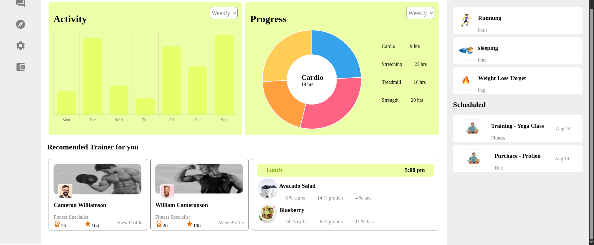

# Fitness Tracker

- fullstack app with node and React
- users can register to create account and this also creates dummy datas for schedule and daily progress(with random values)
- user can set their profile by updating personal information and their fitness goals
- activity percent is shown on bar graph and time spent on exercise is shown in doughnut chart
- user can click on activity graph to see progress of that day
- user can click on doughnut chart to see time spent on that exercise
- static data given for training and diet

## Table of contents

- [Tech stack](#tech-stack)
- [Frontend](#frontend)
- [Backend](#backend)
- [Database](#database)
- [dotenv](#dotenv)

## Tech stack

- frontend: html, css, js
- backend: node.js ( v22.17.0 )
- database: postgres
- typeorm
- mui
- chart.js

## Frontend

- frontend is in `fitness-tracker`
  Yarn is used in this project to manage our packages.
- version 1.22.22

```shell
# check if yarn has been installed
yarn -v
# or install yarn with npm
npm i yarn -g
# install package dependencies
yarn
#start backend
yarn dev
```

## Backend
- frontend is in `backend`

Yarn is used in this project to manage our packages.

- version 1.22.22

```shell
# check if yarn has been installed
yarn -v
# or install yarn with npm
npm i yarn -g
# install package dependencies
yarn
#start backend
yarn dev
```

## Database

- postgres database is used for storing data
- schema can be found at `notes/dbSchema.txt`
- create new database to store tables

## dotenv

create a .env file in backend folder and add the following parameters

- FRONT_END_URL='http://localhost:5173/' (url on which frontend is running)
- PORT=3000(port on which backend should listen to)
- DB_NAME
- DB_USERNAME
- DB_PASSWORD
- DB_HOST

create a .env.local in fitness-tracker folder and add the following parameters

- VITE_BACKEND_BASE_URL_V1='http://localhost:3000/api/v1'(if PORT of backend is 3000)


